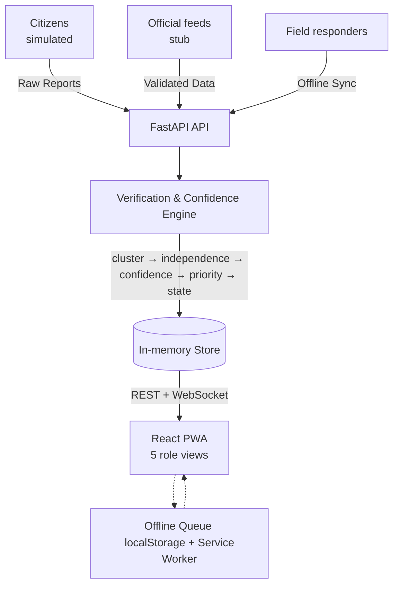

# 🚇 VeriTransit — Crowd-Report Verification & Confidence Dashboard

[](https://www.python.org/downloads/)
[](https://nodejs.org/)
[](https://opensource.org/licenses/MIT)

A field-ready prototype for a **public transport authority communicating service disruptions**, where decision-makers cannot verify crowd-sourced reports quickly enough. VeriTransit ingests simulated citizen reports (location, time, corroborating sources, responder verification), **clusters** them into incidents, scores an **explainable confidence**, ranks by **priority**, and surfaces *verified, high-priority* incidents fast — with drill-down evidence, freshness/staleness states, an offline field-capture workflow, and a measurable experiment proving it beats manual triage.

> **Note:** This is an **end-to-end working prototype**, not a concept deck or an isolated notebook. See [`docs/`](docs/) for the PRD, architecture, implementation plan, and limitations report.

---

## 📑 Table of Contents
- [What's Inside](#-whats-inside)
- [Architecture at a Glance](#-architecture-at-a-glance)
- [Quick Start](#-quick-start)
  - [1. Backend](#1-backend-api--engine--simulator--metrics)
  - [2. Frontend](#2-frontend-dashboard)
  - [3. Drive It](#3-drive-it)
- [Verify it Works](#-verify-it-works)
- [The Five Role Views](#-the-five-role-views)
- [Edge & Failure Cases](#-edge--failure-cases)
- [Demo Script](#-demo-script)
- [Notes & Scope](#-notes--scope)

---

## 📦 What's Inside

| Deliverable (from the brief) | Where |
|---|---|
| Requirements specification | [`docs/01-PRD.md`](docs/01-PRD.md) |
| System architecture | [`docs/02-System-Architecture.md`](docs/02-System-Architecture.md) |
| Implementation plan | [`docs/03-Implementation-Plan.md`](docs/03-Implementation-Plan.md) |
| Limitations + benefits-vs-risks report | [`docs/04-Limitations.md`](docs/04-Limitations.md) |
| Core algorithm / rules | [`backend/engine/`](backend/engine/) |
| API + official-feed integration stub | [`backend/app/`](backend/app/), [`backend/simulator/official_feed_stub.py`](backend/simulator/official_feed_stub.py) |
| Validation dataset (labelled, seeded simulator) | [`backend/simulator/generate.py`](backend/simulator/generate.py) |
| Measurable experiment + error analysis | [`backend/metrics/experiment.py`](backend/metrics/experiment.py) |
| Prototype screens (5 role views) | [`frontend/src/views/`](frontend/src/views/) |
| Metric dashboard | Analyst / Admin view in the app |
| Edge / failure cases | [`backend/tests/test_edge_cases.py`](backend/tests/test_edge_cases.py) |

---

## 🏗 Architecture at a Glance



Deterministic, rule-based engine → every confidence score decomposes into named signals ("why this score"), and every experiment run is reproducible per seed.

---

## 🚀 Quick Start

**Prerequisites:** Python 3.11+, Node 18+.

### 1. Backend (API + engine + simulator + metrics)

```bash
cd backend
python -m venv .venv
# Windows: .venv\Scripts\activate    |    macOS/Linux: source .venv/bin/activate
.venv/Scripts/pip install -r requirements.txt
.venv/Scripts/python -m uvicorn app.main:app --port 8000
```

API is now running at `http://localhost:8000` (docs available at `/docs`).

### 2. Frontend (dashboard)

```bash
cd frontend
npm install
npm run dev
```

Open the printed URL (e.g., `http://localhost:5173`). The dev server proxies `/api` and `/ws` to the backend.

### 3. Drive It

- Click **▶ Load storm scenario** in the top bar (loads ~574 simulated reports → ~122 incidents).
- Switch **roles** (top bar) to see role-based views.
- Open the **Analyst / Admin** view and click **Run experiment** to see the baseline → target → measured comparison.

---

## ✅ Verify it Works

```bash
cd backend
.venv/Scripts/python -m pytest -q            # engine + 5 edge-case tests
.venv/Scripts/python -m metrics.experiment   # prints the full experiment JSON
```

**Expected experiment result (20 seeds, deterministic):**

| Metric | Baseline | Target | Measured |
|---|---|---|---|
| Median time-to-verified-high-priority | 2499 s (manual FIFO) | −50% | **999 s (−60%)** ✓ |
| High-priority recall | — | ≥ 0.90 | **1.00** ✓ |
| Precision of verified high-priority | 0.035 (act-on-all) | ≥ 0.85 | **1.00** ✓ |
| False-verified rate | 0.965 (act-on-all) | ≤ 0.05 | **0.00** ✓ |
| Misinformation reached VERIFIED | — | 0 | **0** ✓ |

---

## 👥 The Five Role Views

| Role | View | What it does |
|---|---|---|
| 🧑‍🚒 **Field Responder** | Capture & Verify | Fast offline-first capture (GPS auto-fill, category chips, severity), one-tap confirm/deny; queues offline and syncs on reconnect with capture-time truth |
| 👮 **Duty Officer** | Triage Queue | Incidents ranked by priority; confidence bar, freshness pill, drill-down evidence + "why this score" |
| 🗺️ **Decision-Maker** | Situation Map | Self-contained SVG map (works offline), verified-only toggle, separate tray for unlocated incidents |
| 📢 **Public Info Officer** | Comms Board | Verified-only cards with a publish gate (only VERIFIED, non-stale incidents publish) |
| 📊 **Analyst / Admin** | Metrics & Admin | Live KPIs, the measurable experiment, and the audit trail |

---

## 🚧 Edge & Failure Cases

All handled and covered by tests (`backend/tests/test_edge_cases.py`):

1. **Conflicting corroboration** → incident goes `DISPUTED`.
2. **Stale / expired data** → auto-transitions `STALE` → `EXPIRED`, publish blocked.
3. **Coordinated misinformation burst** → flagged, corroboration credit collapsed, held below VERIFIED (see the Riverside "BREAKING evacuate" cluster in the demo).
4. **Missing location / time** → explicit `MISSING` state, retained but not clustered, never placed at (0,0).
5. **Connectivity loss / late sync** → offline queue syncs as `DELAYED_SYNC`, scored at capture time, not sync time.

---

## 🎬 Demo Script (~5 minutes)

1. **The Problem:** Load the storm scenario. In the Duty Officer view, note 574 raw reports collapsed into ~122 ranked incidents — the top items are VERIFIED-bound high-priority floods, not buried in noise.
2. **Explainable Trust:** Drill into the top flood → the "why this score" panel shows the exact signals (corroboration + reputation + official match + recency).
3. **Misinformation:** Open the ⚑ flagged Riverside cluster — 14 identical "evacuate now" posts from 2 accounts; confidence collapsed to ~20, held below VERIFIED.
4. **Field / Offline:** In the Field Responder view, tick "Simulate offline", capture a report, untick — it syncs as `DELAYED_SYNC`.
5. **Publish Gate:** As PIO, try to publish a non-verified incident (blocked); verify one as Officer, then publish it.
6. **Proof:** Analyst view → Run experiment → baseline vs. measured, all targets met.

---

## 📝 Notes & Scope

- **Storage:** in-memory (single-process) for a zero-setup prototype; the store interface mirrors a SQLite/Postgres+PostGIS swap (see architecture doc).
- **Map/charts:** inline SVG (no external tiles/CDN) so the dashboard is fully self-contained and offline-capable.
- **Data:** entirely synthetic via the seeded simulator; reporters are pseudonymous.
- Benefits, operational risks, and social risks are compared in [`docs/04-Limitations.md`](docs/04-Limitations.md) and PRD §9.
