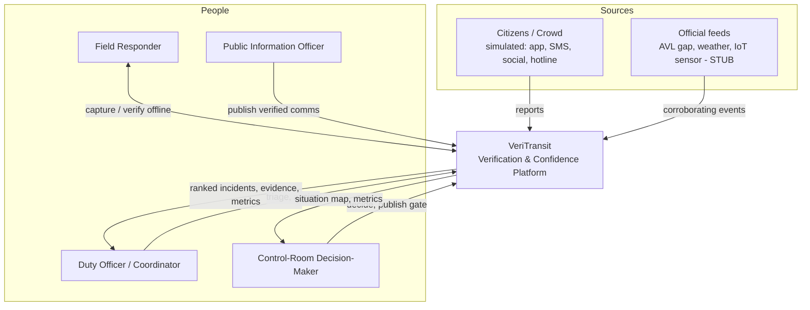
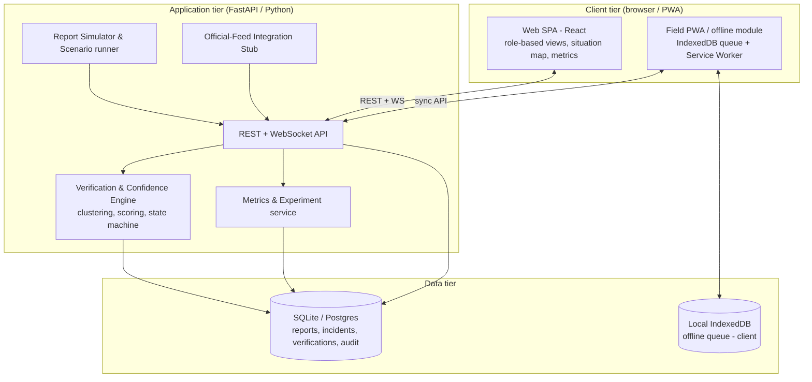
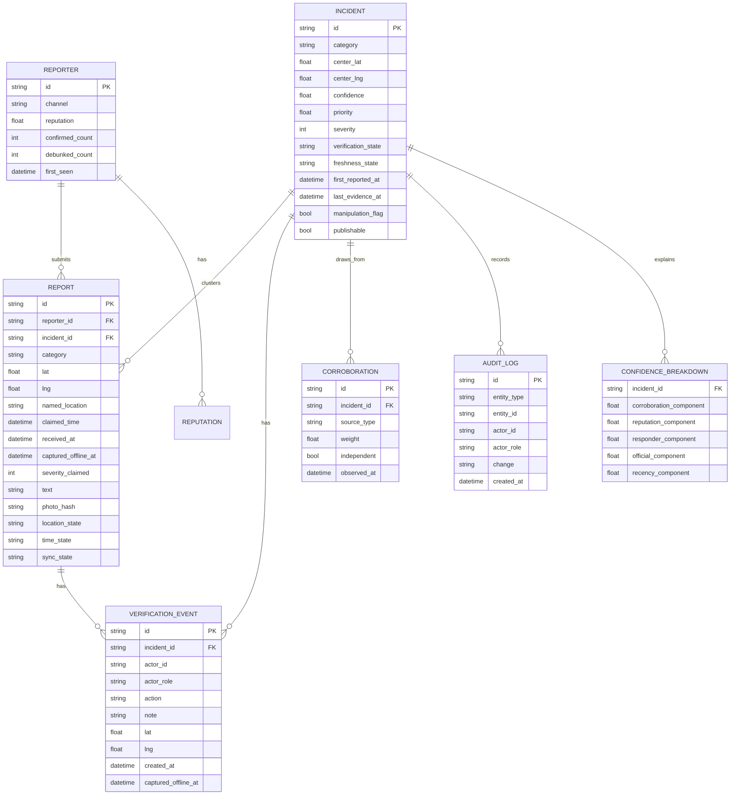
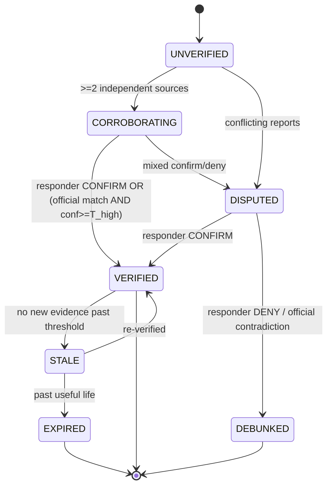
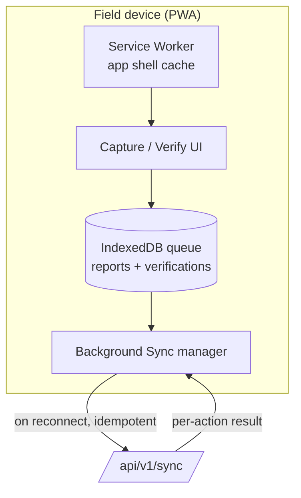
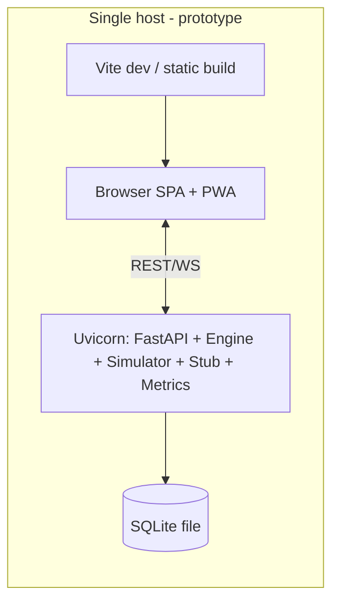

# System Architecture
## VeriTransit — Crowd-Report Verification & Confidence Dashboard

| | |
|---|---|
| **Document** | System Architecture |
| **Version** | 1.0 |
| **Date** | 2026-08-18 |
| **Companion docs** | `01-PRD.md`, `03-Implementation-Plan.md` |

---

## 1. Architectural Goals & Constraints

Derived from the PRD:

1. **Explainable, not black-box** — every confidence score decomposes into named signals (NFR-3).
2. **Offline-first field client** — capture/verify must survive no-network and sync later (FR-14/15).
3. **Honest about state** — missing / stale / disputed are explicit, first-class enums, not nulls (§4.5 PRD).
4. **Human-in-the-loop & auditable** — the engine ranks; humans decide; everything is logged (FR-17/18).
5. **Runs on a laptop for the prototype** — SQLite + local API + browser SPA; horizontally-scalable path documented but not built.
6. **Deterministic & testable** — rule-based scoring so the measurable experiment is reproducible.

**Non-goals architecturally:** no live-feed integration (stubs only), no distributed cluster, no production auth server (role selection is simulated with signed local sessions).

---

## 2. C4 Level 1 — System Context



---

## 3. C4 Level 2 — Container Diagram



**Container responsibilities**

| Container | Responsibility | Tech (prototype) |
|---|---|---|
| Web SPA | Role views, drill-down, situation map, metrics dashboard | React + Vite, MapLibre GL, Recharts |
| Field PWA / offline module | Capture & verify offline, queue, background sync | Service Worker + IndexedDB (Dexie) |
| REST + WS API | Ingestion, queries, verification actions, live push | FastAPI, WebSockets |
| Verification & Confidence Engine | Clustering, scoring, state machine, manipulation checks | Pure Python module (deterministic) |
| Report Simulator | Generate labelled mixed streams for experiments | Python, seeded RNG |
| Official-Feed Stub | Emit synthetic AVL/weather/sensor corroboration | Python, config-driven |
| Metrics service | TTVHP, precision/recall, error analysis vs. ground truth | Python + SQL |
| Data store | Persistence + audit trail | SQLite (prototype) → Postgres/PostGIS (scale) |

---

## 4. Data Model



**State enums (explicit, never null):**
- `verification_state`: `UNVERIFIED | CORROBORATING | VERIFIED | DISPUTED | DEBUNKED`
- `freshness_state`: `FRESH | RECENT | AGING | STALE | EXPIRED`
- `location_state` / `time_state`: `PRESENT | MISSING | LOW_ACCURACY`
- `sync_state`: `SYNCED | QUEUED | DELAYED_SYNC`

---

## 5. Core Algorithm — Clustering, Confidence, Priority

> **Full Specification:** See [`05-Algorithm-Parameters-And-Formulas.md`](05-Algorithm-Parameters-And-Formulas.md) for complete mathematical formulas, exact decay window tables ($\tau$), Haversine centroid equations, and burst detection parameters.

The engine is **deterministic and rule-based** so experiments are reproducible and every score is explainable. It is structured as a pipeline; each stage is independently testable.

### 5.1 Pipeline

```mermaid
flowchart LR
    A[New report / event] --> B[Normalise + validate<br/>set location/time/sync states]
    B --> C[Cluster into Incident<br/>spatial + temporal + category]
    C --> D[Assess independence<br/>reporter, text-similarity, burst]
    D --> E[Compute confidence signals]
    E --> F[Aggregate confidence 0-100]
    F --> G[Compute priority = sev x conf x impact]
    G --> H[Advance state machine + freshness]
    H --> I[Persist + audit + push over WS]
```



### 5.2 Clustering (FR-4)
A report joins an existing open incident when **all** hold:
- same `category` (with a small compatible-category map, e.g. flood↔water-on-track),
- haversine distance ≤ **R** (default 250 m; category-tunable),
- |claimed_time − incident.window| ≤ **T** (default 15 min).

Otherwise it seeds a new incident. Reports with `location_state = MISSING` are **not** spatially clustered — they attach as "unlocated evidence" and are flagged for enrichment (edge case §8.4 PRD).

### 5.3 Independence assessment (anti-manipulation, FR-8)
Corroboration credit is discounted for non-independent reports:
- **same reporter** → subsequent reports add ~0 corroboration weight,
- **near-duplicate text** (token Jaccard ≥ 0.9) → treated as one source,
- **burst detection** (≥ N reports in short window from few reporters) → sets `manipulation_flag`, collapses corroboration weight and requires responder confirmation before VERIFIED.

### 5.4 Confidence score (0–100) — weighted, explainable (FR-5)

```
confidence = 100 * clamp(
      w_c * corroboration_signal      // independent corroborating reports (log-scaled, capped)
    + w_r * reputation_signal         // mean reporter reputation of independent sources
    + w_v * responder_signal          // +strong for CONFIRM, negative for DENY
    + w_o * official_signal           // official-feed match (AVL/weather/sensor)
    + w_t * recency_signal            // exponential freshness decay
    , 0, 1)

default weights: w_v=0.35, w_c=0.25, w_o=0.20, w_r=0.10, w_t=0.10
```

Signal notes:
- **corroboration_signal** = `min(1, log2(1+independent_sources)/log2(1+CAP))` — diminishing returns; 50 dependent retweets ≠ 50 sources.
- **responder_signal** — a single field CONFIRM is the strongest positive; a DENY pushes toward `DISPUTED`/`DEBUNKED`.
- **official_signal** — binary/graded match to a stub feed event in the same window.
- **reputation_signal** — reporter reputation is **behaviour-based and decaying** (confirmed↑, debunked↓), never identity-based (avoids bias against new/low-connectivity users; see PRD §9).
- **recency_signal** — `exp(-Δt/τ)`, τ per category (a flood is actionable longer than a platform-crowding spike).

Each component is stored in `CONFIDENCE_BREAKDOWN` and rendered verbatim in the "**why this score**" drill-down (NFR-3, FR-10).

### 5.5 Priority (FR-6)
```
priority = severity_norm * confidence_norm * impact_norm
impact_norm = f(line criticality, estimated affected passengers, time-of-day)
```
The triage queue sorts by `priority` desc, with confidence and freshness shown alongside so an officer sees *why* something is near the top.

### 5.6 State machine (verification)



Freshness is a **parallel** state advanced by a lightweight scheduler (tick every 30–60 s) independent of verification — so a VERIFIED incident can also be STALE, and the UI shows both.

---

## 6. API Design (REST + WebSocket)

Base: `/api/v1`. Auth: role-scoped session token (simulated). All writes are audited.

| Method | Path | Role | Purpose |
|---|---|---|---|
| `POST` | `/reports` | ingestion / simulator | Submit a citizen report (FR-1) |
| `POST` | `/reports/batch` | simulator | Bulk ingest for experiments |
| `POST` | `/feeds/official` | stub | Corroborating official event (FR-3) |
| `GET` | `/incidents?role=&state=&fresh=&sort=priority` | all | Role-filtered incident list |
| `GET` | `/incidents/{id}` | all | Incident + confidence breakdown |
| `GET` | `/incidents/{id}/evidence` | officer+ | Drill-down: reports, sources, verifications (FR-10) |
| `POST` | `/incidents/{id}/verify` | responder/officer | CONFIRM / DENY / NEEDS_MORE (FR-7) |
| `POST` | `/incidents/{id}/publish` | PIO / DM | Publish gate — VERIFIED only or logged override (FR-17) |
| `POST` | `/sync` | field PWA | Reconcile offline queue (FR-15) |
| `GET` | `/metrics/experiment` | analyst | TTVHP, precision/recall, error analysis (FR-13) |
| `GET` | `/audit?entity=` | analyst/DM | Audit trail (FR-18) |
| `WS` | `/ws/incidents` | all | Live push of incident/state changes |

**Offline sync contract (`POST /sync`)** — the crux of field mode:
- Request carries a batch of queued actions each with a **client-generated UUID** and `captured_offline_at`.
- Server is **idempotent** on the UUID (safe re-send), applies actions using **capture time** (not receipt time) for scoring, returns per-action `applied | duplicate | conflict`.
- Conflicts (e.g., incident already DEBUNKED) return the server state so the client can reconcile and show the user; never silent overwrite.

**Missing-data contract:** the ingestion API accepts reports with absent location/time and returns the assigned explicit state (`location_state=MISSING`) rather than rejecting or defaulting to (0,0).

---

## 7. Offline / Low-Bandwidth Architecture (FR-14/15/16)



- **App shell** cached by Service Worker → app opens with no network.
- **Writes go to IndexedDB first** (optimistic UI), each stamped with UUID + capture time; badge shows unsynced count.
- **Background Sync** flushes the queue when connectivity returns; items show `QUEUED` → `DELAYED_SYNC` → `SYNCED`.
- **Low-bandwidth mode:** text-only payloads, images deferred (hash sent, blob later), delta polling instead of WS, coarse map tiles. Toggleable and auto-suggested on slow links.
- **Truth = capture time.** A verification done offline at 10:00 and synced at 10:20 scores as of 10:00 and the UI reads "verified 20 min ago (synced just now)."

---

## 8. Frontend Architecture & Screens

Single React SPA; the **role** selects the layout, the data scope, and the allowed actions.

| View | Role | Key components | Explicit-state handling |
|---|---|---|---|
| **Capture & Verify** | Responder | Category chips, severity slider, GPS auto-fill, one-tap CONFIRM/DENY, offline badge | MISSING location prompt; QUEUED/DELAYED_SYNC banners |
| **Triage Queue** | Duty Officer | Priority-sorted list, confidence bar, freshness pill, assign, drill-down | STALE greys out; DISPUTED split badge; empty-state card |
| **Situation Map + Metrics** | Decision-Maker | MapLibre incident clusters, verified-only toggle, TTVHP trend | MISSING-location incidents in a separate "unlocated" tray |
| **Comms Board** | PIO | VERIFIED-only cards, source count, suggested message, publish gate | Publish disabled + reason when not VERIFIED/STALE |
| **Metrics & Admin** | Analyst | Baseline vs. measured, precision/recall, error table, weight tuning, audit log | "No experiment run yet" explicit empty state |

**Cross-cutting UI rules:** every state has an icon **and** a text label (NFR-4); freshness shown as relative time + colour + label; a "why this score" popover everywhere a confidence number appears; missing data rendered as a labelled `—/MISSING` chip, never blank.

---

## 9. Cross-Cutting Concerns

- **Security & access:** role-scoped tokens; PIO/DM-only publish; responder cannot publish; all mutations audited with actor+role+time.
- **Privacy:** reporters are **pseudonymous**; minimal PII; location retained only as needed; reputation is behavioural, not identity-linked (PRD §9 social-risk mitigation).
- **Explainability & bias guard:** transparent weights; reputation decays and is earned by confirmed reports, preventing entrenchment against new/low-connectivity communities.
- **Observability:** structured logs, per-stage engine timings, experiment metrics endpoint.
- **Determinism:** seeded simulator + pure-function engine → reproducible experiment runs for the validation report.

---

## 10. Technology Choices & Rationale

| Concern | Choice | Why | Scale-up path |
|---|---|---|---|
| Backend | **FastAPI (Python)** | Fast to build, async WS, engine in same language as simulator | Gunicorn/Uvicorn workers behind LB |
| Engine | **Pure Python module** | Deterministic, testable, explainable | Extract to service; add ML scorer behind same interface |
| DB | **SQLite** (prototype) | Zero-setup, single-file, laptop-friendly | **Postgres + PostGIS** for geo + concurrency |
| Frontend | **React + Vite** | Component reuse across role views, PWA support | Same |
| Map | **MapLibre GL** | Open, offline-capable tiles | Self-hosted tile server |
| Offline | **Service Worker + IndexedDB (Dexie)** | Standard PWA offline-first stack | Same |
| Realtime | **WebSocket** (+ polling fallback) | Live triage updates; polling for low-bandwidth | Redis pub/sub fan-out |
| Charts | **Recharts** | Metric dashboard | Same |

**Deliberately deferred:** real ML misinformation model (the rule engine is the explainable baseline; ML plugs in behind the scorer interface later), real auth server, live GTFS-RT/AVL integration (stubbed), multi-tenant/HA.

---

## 11. Deployment (prototype)



One command starts the API + engine + simulator; the SPA is served statically. Everything runs offline on one machine, satisfying the "field-ready, laptop-runnable" constraint. A `docker-compose` with Postgres/PostGIS is documented as the scale profile but not required for the demo.

---

## 12. Traceability (architecture ↔ requirements)

| Requirement | Architecture element |
|---|---|
| FR-1/2/3 ingestion & simulation | §6 API `/reports`, `/feeds/official`; Simulator container |
| FR-4/5/6/8 clustering, confidence, priority, anti-manipulation | §5 Algorithm pipeline |
| FR-7 verification updates | §6 `/verify`; §5.6 state machine |
| FR-9/10/11/12 role views, drill-down, freshness, explicit states | §8 Frontend |
| FR-13 metrics | §3 Metrics service; §8 Metrics view |
| FR-14/15/16 field capture & offline | §7 Offline architecture |
| FR-17/18 publish gate & audit | §6 `/publish`, `/audit`; §9 |
| FR-19 edge cases | §5.2 missing-loc, §5.3 manipulation, §5.6 disputed/stale, §7 late sync |
| NFR-3 explainability | §5.4 breakdown; §8 "why this score" |
